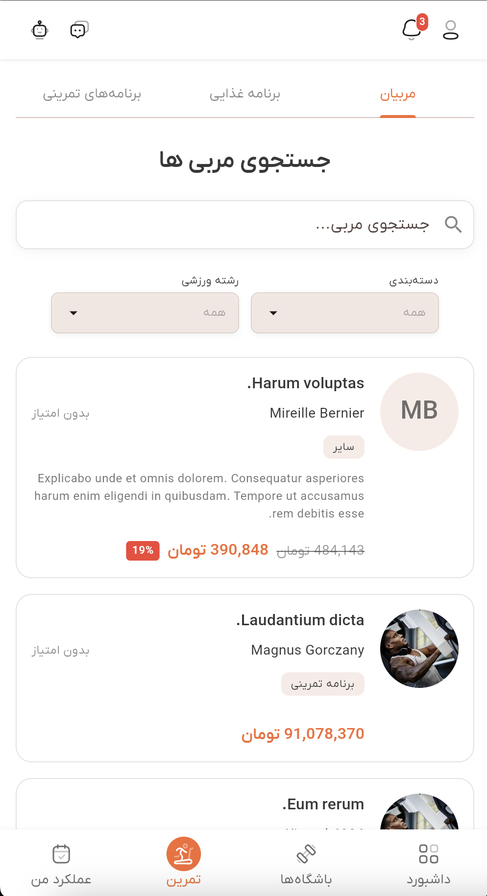

# پیدا کردن مربی

دنبال مربی می‌گردی؟ اینجا می‌تونی مربیانی که برنامه تمرینی، برنامه غذایی و خدمات دیگه ارائه می‌دن رو پیدا کنی. جستجو کن، فیلتر بزن، و یکی رو انتخاب کن که با نیازت جور در بیاد.

## رفتن به صفحه

از منوی اصلی برو تو بخش تمرین، بعد روی تب مربیان بزن. می‌افتی تو صفحه جستجو که همه مربیان و خدماتشون رو نشون می‌ده.

بالای صفحه دو تا دکمه سریع داری: "خدمات من" می‌بره به خدماتی که خودت ارائه می‌دی (اگه مربی هستی)، و "خدمات خریداری شده" نشون می‌ده چی از مربیان دیگه خریدی.

## جستجو

اسم مربی یا کلمه کلیدی رو تو نوار جستجو تایپ کن. نتایج همون لحظه که تایپ می‌کنی آپدیت می‌شن، پس بلافاصله نتیجه می‌بینی. جستجو تو اسم مربیان و توضیحات خدماتشون می‌گرده، و به حروف بزرگ و کوچک کاری نداره.

فیلد جستجو رو خالی کن تا دوباره همه رو ببینی.

## فیلتر کردن

زیر نوار جستجو دو تا منوی فیلتر داری: دسته‌بندی و رشته ورزشی.

دسته‌بندی بهت اجازه می‌ده بین برنامه تمرینی و برنامه غذایی انتخاب کنی. روی منو بزن، چیزی که می‌خوای رو تیک بزن، و اگه نظرت عوض شد "پاک کردن" رو بزن. می‌تونی هر دو رو انتخاب کنی اگه دنبال مربیانی هستی که هر دو رو ارائه می‌دن.

رشته ورزشی جایی‌ه که بر اساس تخصص فیلتر می‌کنی – مثل بدنسازی، پاورلیفتینگ، کراس‌فیت، هر چی که موجود باشه. همون کار: روی منو بزن، تخصص‌هات رو انتخاب کن، و لیست خودکار آپدیت می‌شه.

وقتی فیلتر انتخاب می‌کنی، بالای منوها به صورت چیپ‌های کوچیک نمایش داده می‌شن. روی X هر چیپ بزن تا اون فیلتر رو سریع حذف کنی.

هر جوری دوست داری ترکیب کن. اسم جستجو کن، بر اساس دسته‌بندی و تخصص فیلتر بزن، و محدودش کن تا دقیقا چیزی که می‌خوای رو پیدا کنی.

## چی می‌بینی

هر مربی به صورت یه کارت نمایش داده می‌شه که عکس پروفایلش سمت چپ‌ه (یا حروف اول اسمش اگه عکس آپلود نکرده). اسمش، عنوان خدمت، امتیاز و تعداد نظرات، تخصص‌ها، یه توضیح کوتاه، و قیمت رو می‌بینی.

اگه تخفیف داشته باشه، قیمت اصلی رو خط خورده می‌بینی، قیمت تخفیف خورده، و یه بج درصد. بعضی خدمات یه بج سبز "BOOST" دارن – یعنی مربی پول داده تا خدمتش بالای لیست نمایش داده بشه.

روی هر کارت بزن تا جزئیات کامل رو ببینی، شامل نظرات، کامنت‌ها، و اطلاعات بیشتر درباره چیزی که ارائه می‌ده.

اگه هیچی با جستجو یا فیلترهات جور در نیومد، پیام "هیچ مربی یافت نشد" رو می‌بینی. فقط فیلترهات رو تنظیم کن یا پاکشون کن تا نتایج بیشتری ببینی.

خطا؟ یه پیام با دکمه "تلاش مجدد" می‌بینی. معمولا یعنی مشکل اتصال.

## صفحه‌بندی

وقتی مربیان زیادی هستن، نتایج به چند صفحه تقسیم می‌شن. به پایین اسکرول کن و کنترل‌های صفحه رو می‌بینی: دکمه‌های قبلی و بعدی، به علاوه یه شمارنده صفحه که نشون می‌ده کجایی (مثل "۲/۵"). یه شمارش ردیف هم هست که می‌گه از کل نتایج، کدوم‌ها رو داری می‌بینی.

جستجو و فیلترهات وقتی صفحه عوض می‌کنی باقی می‌مونن، پس جات رو گم نمی‌کنی.

## رفرش کردن

از بالای صفحه به پایین بکش تا لیست رفرش بشه. مفیده اگه جایی تغییری دادی یا می‌خوای ببینی مربیان جدیدی اضافه شدن یا نه.

## وقتی مشکل پیش میاد

لیست لود نمی‌شه؟ اتصال اینترنتت رو چک کن و از بالا به پایین بکش تا رفرش بشه. اگه صفحه خطا دیدی، روی "تلاش مجدد" بزن.

جستجو کار نمی‌کنه؟ فیلد جستجو رو پاک کن و دوباره امتحان کن. مطمئن شو درست تایپ کردی، یا کلمات کلی‌تری امتحان کن. اگه نتیجه نمی‌گیری فیلترها رو حذف کن.

فیلترها عجیب رفتار می‌کنن؟ مطمئن شو واقعا انتخاب شدن (باید هایلایت باشن). همه رو پاک کن و دوباره اعمال کن اگه لازمه. صفحه رو رفرش کن.

نتیجه‌ای نیست؟ فیلترها و جستجو رو پاک کن، بعد ترکیب‌های مختلف امتحان کن. گاهی وقتا خیلی خاص بودن نتیجه نمی‌ده.

صفحه‌بندی گیر کرده؟ صبر کن صفحه فعلی کامل لود بشه، اتصالت رو چک کن، و دوباره امتحان کن.

## نکته‌ها

وقتی جستجو می‌کنی گسترده شروع کن – بدون فیلتر، فقط مرور کن. بعد با دسته‌بندی محدودش کن، تخصص‌ها رو اضافه کن، و اگه می‌دونی دنبال کی می‌گردی اسم خاص جستجو کن.

صفحات بعدی رو رد نکن. مربیان خوب ممکنه صفحه اول نباشن، مخصوصا اگه خدمتشون رو بوست نکرده باشن.

قبل از تصمیم‌گیری چند تا مربی رو چک کن. امتیازاتشون، نظراتشون، تخصص‌هاشون، و قیمت‌هاشون رو ببین. روی پروفایل کاملشون بزن تا همه چیزی که ارائه می‌دن رو ببینی.

اگه کمک لازم داری، دستیار هوش مصنوعی می‌تونه راهنماییت کنه (روی آیکون ربات بزن). فقط ازش بخواه کمکت کنه مربیانی با تخصص یا خدمات خاص پیدا کنی.
