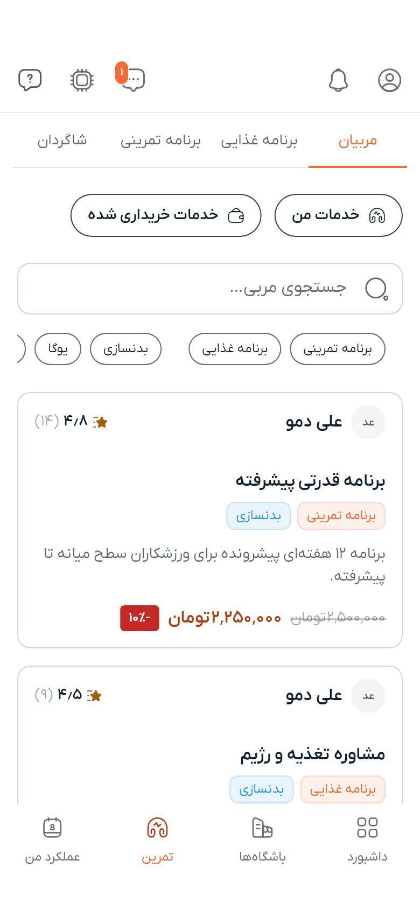
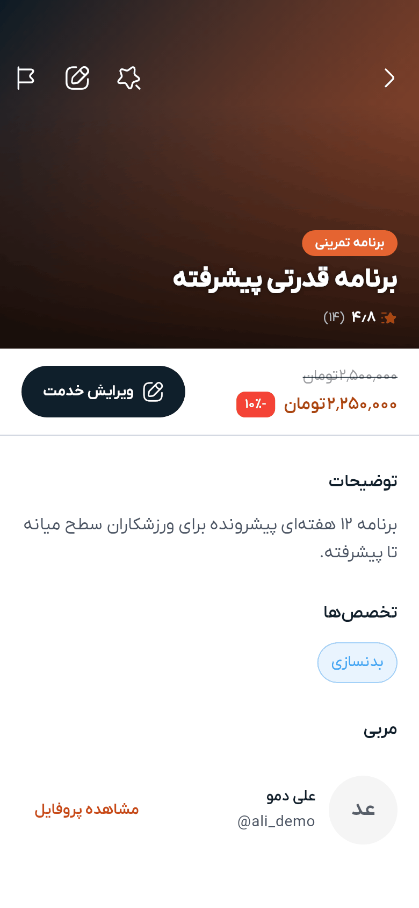
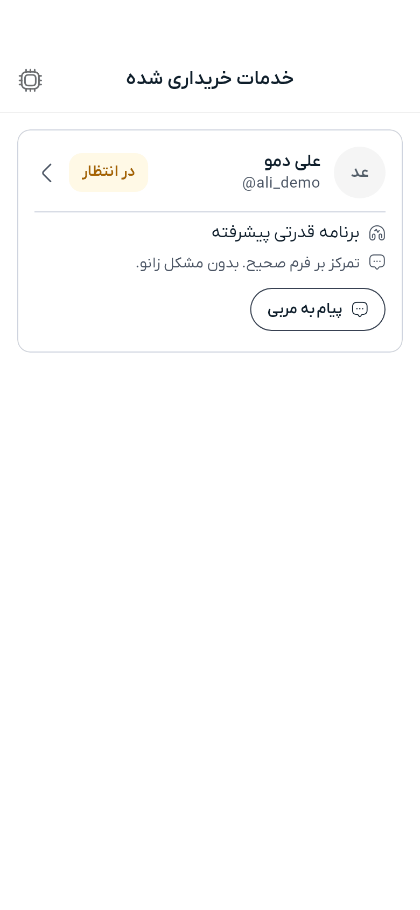
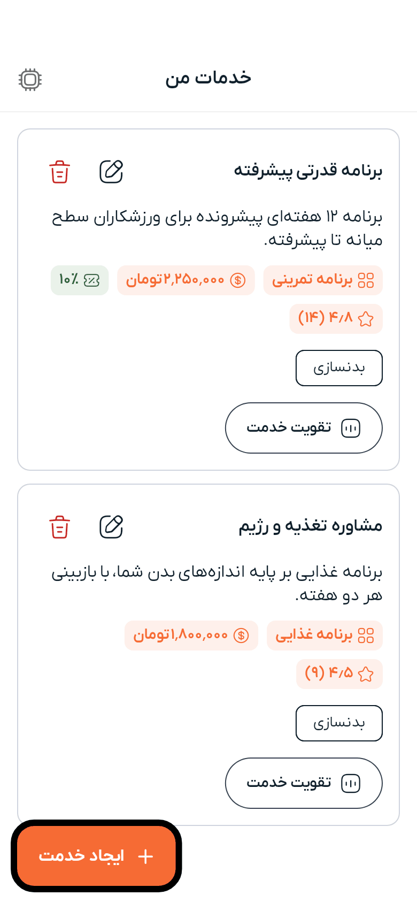
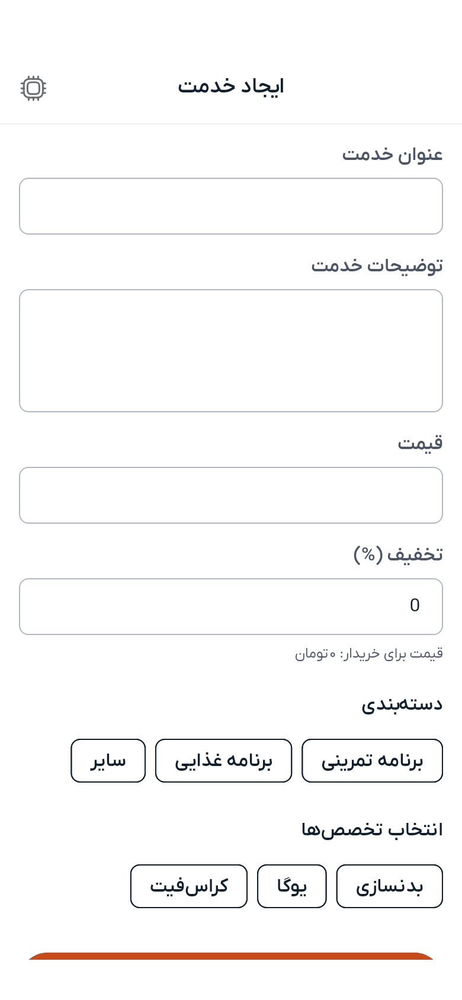
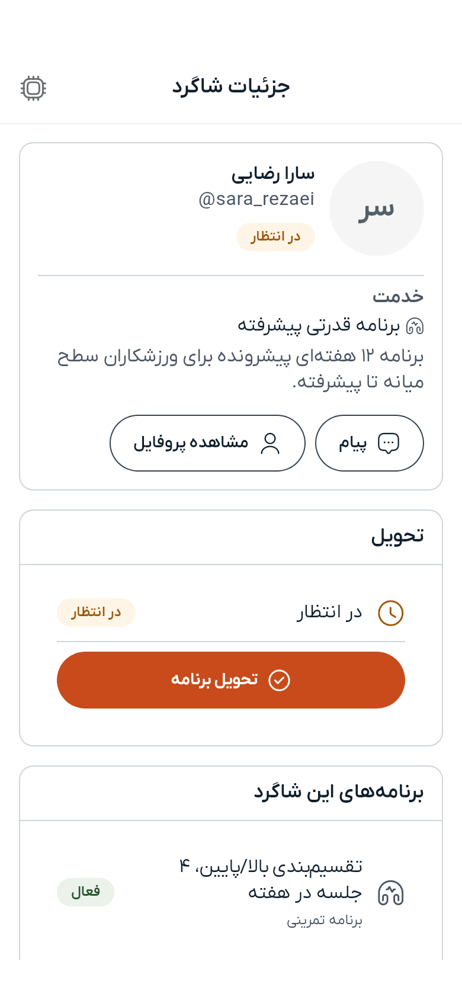

# مربیان

دنبال مربی می‌گردید؟ همین‌جا جستجو کنید، پروفایل‌ها را ببینید و مستقیم خدمت بخرید.

---

## پیدا کردن مربی

به «تمرین ← مربیان» بروید. این نخستین بخش «تمرین» است؛ اینکه چه بخش‌های دیگری می‌بینید — برنامه‌های غذایی، برنامه‌های تمرینی، شاگردان — به کاربرد حساب شما بستگی دارد.

می‌توانید:
- بر پایهٔ نام یا کلیدواژه جستجو کنید
- بر پایهٔ دسته فیلتر کنید: برنامهٔ تمرینی یا برنامهٔ غذایی
- بر پایهٔ رشتهٔ ورزشی فیلتر کنید: بدنسازی، کراس‌فیت، پاورلیفتینگ، یوگا و بیشتر

مربیانی که آگهی خود را تقویت کرده‌اند بالای نتایج می‌آیند. هر کارت مربی را بزنید تا پروفایلش باز شود.

---

## پروفایل مربی

پروفایل یک مربی نشان می‌دهد:
- نام و نام کاربری او، همراه با نشان مدرک تأییدشده وقتی دمبل مدرک مربیگری او را تأیید کرده باشد
- امتیاز مربی، که میانگین امتیاز همهٔ خدمات امتیازگرفتهٔ اوست
- خدماتی که منتشر کرده است، با قیمت هرکدام؛ یکی را بزنید تا باز شود

از همان‌جا می‌توانید به مربی پیام بدهید یا پروفایل کامل حساب او را باز کنید.

---

## خرید خدمت

در پروفایل مربی، یک خدمت را بزنید تا جزئیات کاملش را ببینید. وقتی آماده شدید:
۱. «خرید خدمت» را بزنید
۲. تأیید کنید — دمبل نام خدمت و قیمت آن را می‌گوید
۳. مبلغ از کیف پول شما کم می‌شود

پس از خرید، به‌جای دکمه عبارت «خریداری شد» و پیوندی به رکورد آن دیده می‌شود، تا یک خدمت دو بار خریده نشود. مربی روی خدمت خودش به‌جای آن «ویرایش خدمت» را می‌بیند.

---

## خدمات خریداری‌شدهٔ شما

«خدمات خریداری شده»، در بالای بخش «مربیان»، هر چه را خریده‌اید فهرست می‌کند؛ بخش جداگانه‌ای نیست. هر ردیف را بزنید تا رکوردش باز شود، یا با «پیام به مربی» بدون بیرون‌آمدن از فهرست گفتگو را آغاز کنید.

امتیاز دادن به یک خدمت کار خریدار است: فرم پس از خرید دیده می‌شود و می‌گوید امتیاز تازه‌ای ثبت می‌کنید یا امتیاز پیشین خود را ویرایش.

---

## برای مربیان — ارائهٔ خدمت

اگر مربی هستید، می‌توانید خدماتی را که ارائه می‌دهید ایجاد و اداره کنید.

### خدمات من

«خدمات من»، در بالای بخش «مربیان»، هر چه را منتشر کرده‌اید فهرست می‌کند.

### ایجاد خدمت

«+» را بزنید و این‌ها را پر کنید:
- نام و توضیح خدمت
- قیمت، و تخفیف بر حسب درصد — فرم زیر همین دو فیلد می‌گوید خریدار در عمل چقدر می‌پردازد
- دسته: برنامهٔ تمرینی یا برنامهٔ غذایی
- رشته‌های ورزشی

مدتی برای تعیین نیست: خدمت یک کار است، نه اشتراکی با تاریخ پایان.

**نخست باید مدرک شما تأیید شده باشد.** خدمتی که با مدرک مربیگری نداشته، در انتظار یا ردشده منتشر شود به هیچ‌کس نشان داده نمی‌شود، و فرم همین را بالای صفحه با پیوندی به پروفایل شما می‌گوید تا از سکوتِ نتیجه متوجهش نشوید.

### دیده‌شدن، و اینکه چطور پیش می‌رود

فرم یک خدمت موجود دو بخش دیگر هم دارد: «تقویت خدمت»، که آن را برای چند روز بالای نتایج می‌آورد و از کیف پول شما پرداخت می‌شود ([اشتراک ویژه، تقویت و پول](monetization.md))، و «گزارش‌های داده» — اینکه چند بار در جستجو آمده، چند بار باز شده و در چه ساعت‌هایی ([گزارش‌های داده](analytics.md)).

### مدیریت شاگردان

«تمرین ← شاگردان» — بخشی که تنها برای حساب‌هایی هست که خود را مربی معرفی کرده‌اند — همهٔ شاگردان کنونی شما را فهرست می‌کند. هر شاگرد را بزنید تا:
- برنامه‌های تمرینی و غذایی که برای او نوشته‌اید را ببینید و هرکدام را باز کنید
- برنامه را با «تحویل برنامه» به او بدهید — انتخاب می‌کنید کدام برنامه تحویل شود، تأیید می‌کنید، و رکورد بی‌درنگ در فهرست «تحویل داده شده» می‌شود. به شاگرد اطلاع داده می‌شود. اگر لازم شد برگردانید، همان کارت «بازگرداندن به در انتظار» را پیشنهاد می‌دهد
- به او پیام بدهید یا پروفایلش را باز کنید
- یادداشت خصوصی خود دربارهٔ تمرین او را نگه دارید

تحویل به یک برنامه نیاز دارد: اگر هنوز برنامه‌ای برای این شاگرد ننوشته‌اید، دمبل همین را می‌گوید و چیزی را علامت نمی‌زند.

برای ثبت کسی که بیرون از دمبل به شما پرداخت کرده است، «افزودن شاگرد» را بزنید، او را جستجو کنید، یکی از خدمات خود را انتخاب کنید و اگر خواستید یادداشتی بیفزایید. کارمزد دمبل برای آن خدمت از کیف پول شما کم می‌شود، چون او در اپلیکیشن مبلغی نمی‌پردازد؛ پیش از تأیید به شما گفته می‌شود.

---

---

## اگر خدمتی مشکل دارد

«گزارش» روی صفحهٔ یک خدمت، آن را با توضیحی کوتاه برای ما می‌فرستد. [گزارش](reporting.md) را ببینید.

---

> **بعدی:** [با مربی خود گفتگو کنید](chat.md) یا [کیف پول را ببینید](wallet.md)

---

[→ قبلی: عملکرد من](tracker.md) | [بعدی: باشگاه‌ها ←](gyms.md)
