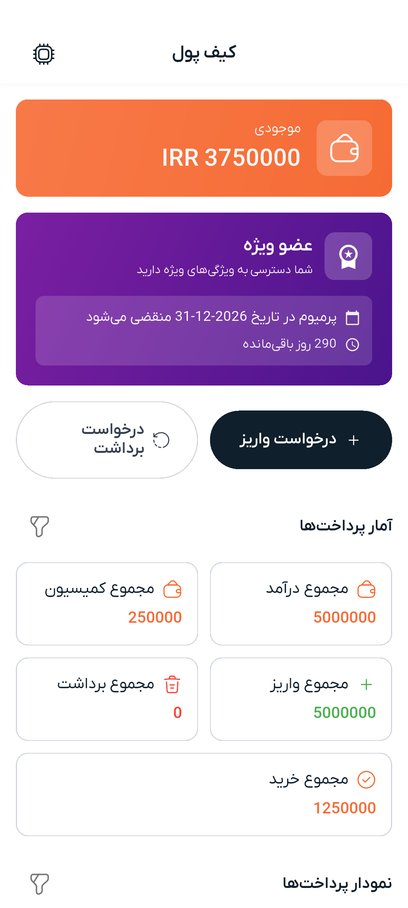

# کیف پول

موجودی کیف پولتون رو برای اشتراک باشگاه، سرویس مربی و ویژگی‌های پرمیوم استفاده می‌کنید.

---

## موجودی

موجودی فعلی در بالای صفحه کیف پول و همچنین در داشبورد نمایش داده می‌شود.

---

## تاریخچه تراکنش

زیر موجودی، لیست کامل تراکنش‌ها را می‌بینید:
- **واریز** — شارژ حساب، پاداش معرفی، بازگشت وجه
- **برداشت** — اشتراک باشگاه، سرویس مربی، خریدهای پرمیوم

هر تراکنش مقدار، تاریخ و توضیح کوتاهی از آنچه بوده نشان می‌دهد.

---

## پرداخت برای سرویس‌ها

وقتی اشتراک باشگاه می‌گیرید یا سرویس مربی خریداری می‌کنید، مبلغ به صورت خودکار از کیف پول کسر می‌شود. اگر موجودی کافی نداشته باشید، درخواست شارژ می‌شود.

---

## معرفی

اگر کسی با کد معرف شما ثبت‌نام کند، ممکن است یک اعتبار به کیف پولتان اضافه شود. تاریخچه تراکنش‌ها را بررسی کنید تا پاداش‌های معرفی را ببینید.

---

> **بعدی:** [باشگاهی برای اشتراک پیدا کنید](gyms.md) یا [سرویس‌های مربیان را مرور کنید](trainers.md)
