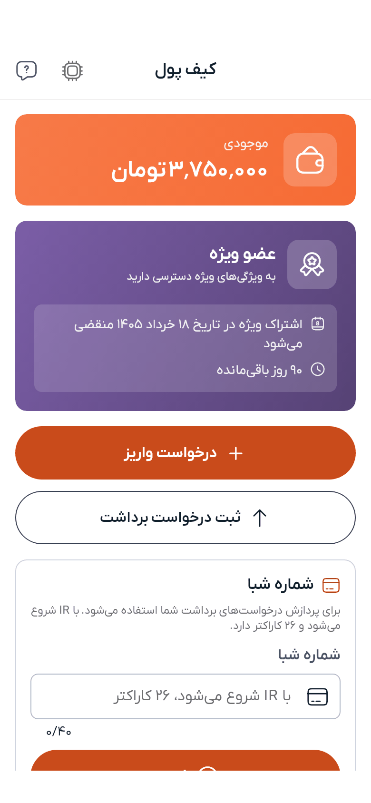
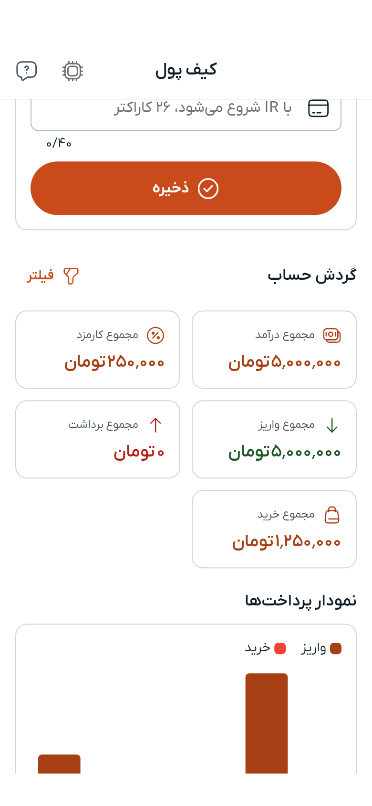

# کیف پول

موجودی کیف پول شما چیزی است که با آن طرح عضویت باشگاه، خدمات مربیان و اشتراک ویژه را می‌پردازید.

---

## موجودی شما

موجودی کنونی در بالای صفحهٔ کیف پول و همچنین در داشبورد دیده می‌شود. همهٔ مبلغ‌ها در دمبل — موجودی، قیمت‌ها و کارمزدها — به **تومان** است.

---

## واریز

«درخواست واریز» کادر مبلغ و سپس صفحهٔ پرداخت بانک را باز می‌کند. کمترین مبلغی که دمبل می‌پذیرد **۱۰٬۰۰۰ تومان** است و کادر همین را می‌گوید تا مبلغ کمتر در درگاه ناموفق نشود.

واریز تنها پس از تأیید درگاه به حساب می‌نشیند و این کار آنی نیست. تا آن زمان، کیف پول نواری با عنوان «پرداخت در انتظار تأیید» و مبلغ آن نشان می‌دهد، همراه با «بررسی وضعیت» و راهی برای بازگشت به صفحهٔ پرداخت — تا پرداختی که انجام داده‌اید و ندیده‌اید کجا رفته، پیدا باشد. نوار پس از رسیدن مبلغ خودش کنار می‌رود.

اگر خریدی بیش از موجودی شما باشد، دمبل می‌گوید چقدر کم دارید و پیشنهاد واریز می‌دهد؛ به‌جای اینکه فقط رد کند.

---

## اشتراک ویژه

اشتراک ویژه از همین‌جا و برای **۱، ۳، ۶ یا ۱۲ ماه** خریداری می‌شود و از موجودی شما کم می‌شود. اینکه چه چیزی به شما می‌دهد و پس از پایانش چه می‌شود، در [اشتراک ویژه، تقویت و پول](monetization.md) آمده است.

---

## تاریخچهٔ تراکنش‌ها

زیر موجودی، فهرست کامل تراکنش‌هاست:
- **واریز** — شارژ حساب، بازگشت وجه
- **برداشت** — طرح عضویت باشگاه، خدمات مربیان، خرید اشتراک ویژه

هر تراکنش مبلغ، نوع، و تاریخ و ساعت انجامش را نشان می‌دهد. روی هر ردیف بزنید تا جزئیاتش باز شود، از جمله شناسه‌ای که اگر روزی لازم شد دربارهٔ آن بپرسید به آن ارجاع می‌دهید.

نموداری بالای فهرست، همان فعالیت را در طول زمان نشان می‌دهد و با فیلترهای زیر خود جابه‌جا می‌شود.

### محدود کردن فهرست

با زدن «فیلتر» بالای بخش گردش حساب، همهٔ آنچه زیر آن است — مجموع‌ها، نمودار و تاریخچه — با هم محدود می‌شود. می‌توانید بر پایهٔ نوع تراکنش، بازهٔ زمانی (هفته، ماه یا سه ماه گذشته، یا تاریخ‌هایی که خودتان انتخاب می‌کنید)، تکمیل‌شدن تراکنش، و ترتیب فیلتر کنید.

---

## شماره حساب بانکی

در صفحهٔ کیف پول می‌توانید **شماره شبا** ذخیره کنید. درخواست‌های برداشت شما به همین حساب واریز می‌شود، پس پیش از ذخیره از درستی آن مطمئن شوید. هر زمان می‌توانید آن را ویرایش کنید — مقدار را عوض کنید و «ذخیره» را بزنید.

### برداشت

«ثبت درخواست برداشت» نخست به همین حساب نیاز دارد: اگر ثبت نشده باشد، کیف پول این را می‌گوید و شما را مستقیم به همان فیلد می‌برد. با حساب ثبت‌شده، کادر برداشت مبلغ قابل برداشت را نشان می‌دهد و بیش از موجودی شما را نمی‌پذیرد.

---

## پرداخت برای خدمات

وقتی اشتراک باشگاه می‌گیرید یا خدمتی از یک مربی می‌خرید، مبلغ خودکار از کیف پول کم می‌شود.

---

## دعوت از دوستان

دعوت‌کردن دیگران پولی به کیف پول شما نمی‌ریزد؛ پاداش، زمان اشتراک ویژه است. به ازای هر **۵ امتیاز**، **۷ روز اشتراک ویژه** رایگان می‌گیرید. لینک شما و شمار افرادی که آن را پذیرفته‌اند، پشت تصویر شما در نوار بالا و زیر «دعوت از دوستان» است. [اشتراک ویژه، تقویت و پول](monetization.md) را ببینید.

---

> **بعدی:** [باشگاهی برای اشتراک پیدا کنید](gyms.md) یا [خدمات مربیان را ببینید](trainers.md)

---

[→ قبلی: اعلان‌ها](notifications.md) | [بعدی: تنظیمات ←](settings.md)
