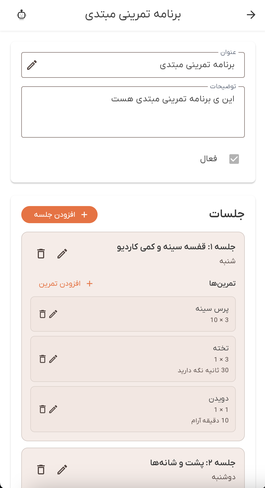

# راهنمای برنامه‌های تمرینی

به بخش برنامه‌های تمرینی دمبل خوش آمدید. این راهنمای جامع شما را با تمام ویژگی‌های برنامه‌های تمرینی آشنا می‌کند، از جمله مشاهده برنامه‌ها، مدیریت جلسات، سازماندهی تمرینات و درک سوپرست‌ها.

## نمای کلی

بخش برنامه‌های تمرینی به شما امکان ایجاد، مشاهده و مدیریت برنامه‌های تمرینی ساختاریافته را می‌دهد. هر برنامه تمرینی شامل جلسات سازماندهی شده بر اساس روز هفته است، با تمریناتی که شامل ست‌ها، تکرارها و توضیحات اختیاری هستند. تمرینات می‌توانند در سوپرست‌ها برای تمرین کارآمد سازماندهی شوند.

برنامه‌های تمرینی اهداف مختلفی دارند:
- **ساختار برنامه**: سازماندهی تمرینات بر اساس روز هفته
- **مدیریت تمرینات**: افزودن تمرینات با تعداد ست و تکرار خاص
- **سازماندهی سوپرست**: گروه‌بندی تمرینات مرتبط با هم
- **برنامه‌ریزی جلسه**: ایجاد جلسات تمرینی برای روزهای خاص
- **مدیریت برنامه فعال**: علامت‌گذاری برنامه‌ها به عنوان فعال یا غیرفعال

## دسترسی به برنامه‌های تمرینی

می‌توانید از صفحه تمرین به برنامه‌های تمرینی دسترسی پیدا کنید:

1. به بخش **تمرین** از ناوبری اصلی بروید
2. تب **"برنامه‌های تمرینی"** را در بالا انتخاب کنید
3. لیستی از تمام برنامه‌های تمرینی موجود را خواهید دید

*لیست برنامه‌های تمرینی که تمام برنامه‌های موجود را با تعداد جلسات نشان می‌دهد*

## مشاهده برنامه‌های تمرینی

لیست برنامه‌های تمرینی تمام برنامه‌هایی که به آن‌ها دسترسی دارید را نمایش می‌دهد:

**اطلاعات برنامه**:
- **عنوان**: نام برنامه تمرینی
- **توضیحات**: توضیحات اختیاری برنامه
- **تعداد جلسه**: تعداد جلسات در برنامه (به صورت نشان نمایش داده می‌شود)
- **وضعیت فعال**: نشان می‌دهد که آیا برنامه در حال حاضر فعال است

**حالت خالی**:
اگر هیچ برنامه تمرینی وجود نداشته باشد، پیامی خواهید دید: "هنوز برنامه تمرینی وجود ندارد" با گزینه ایجاد اولین برنامه.

**صفحه‌بندی**:
اگر برنامه‌های زیادی دارید، از کنترل‌های صفحه‌بندی در پایین برای پیمایش صفحات استفاده کنید.

## باز کردن یک برنامه تمرینی

روی هر کارت برنامه تمرینی ضربه بزنید تا نمای جزئیات باز شود. صفحه جزئیات نشان می‌دهد:

### هدر برنامه

هدر برنامه نمایش می‌دهد:
- **عنوان**: نام برنامه (قابل ویرایش)
- **توضیحات**: توضیحات اختیاری برنامه (قابل ویرایش)
- **وضعیت فعال**: چک‌باکس برای علامت‌گذاری برنامه به عنوان فعال یا غیرفعال

*صفحه جزئیات برنامه تمرینی که اطلاعات برنامه و بخش جلسات را نشان می‌دهد*

### بخش جلسات

بخش جلسات تمام جلسات تمرینی در برنامه را نمایش می‌دهد:

**اطلاعات جلسه**:
- **عنوان**: نام جلسه (مثلاً "روز فشار"، "روز پا")
- **روز**: روز هفته (شنبه، یکشنبه، دوشنبه، سه‌شنبه، چهارشنبه، پنج‌شنبه، جمعه)
- **توضیحات**: توضیحات اختیاری جلسه
- **تمرینات**: فهرست تمرینات در جلسه

**نمایش جلسه**:
هر جلسه نشان می‌دهد:
- عنوان به صورت پررنگ
- روز هفته در زیر عنوان
- توضیحات (در صورت ارائه)
- فهرست تمرینات با اطلاعات ست/تکرار

**حالت خالی**:
اگر هیچ جلسه‌ای وجود نداشته باشد، خواهید دید: "هنوز جلسه وجود ندارد" با دکمه "افزودن جلسه".

## ویرایش یک برنامه تمرینی

برای ویرایش اطلاعات برنامه:

1. روی **آیکون ویرایش** (مداد) کنار فیلد عنوان ضربه بزنید
2. عنوان، توضیحات یا وضعیت فعال را تغییر دهید
3. برای ذخیره تغییرات روی **"ذخیره"** یا برای لغو روی **"لغو"** ضربه بزنید

**اعتبارسنجی**:
- عنوان الزامی است

## مدیریت جلسات

### افزودن یک جلسه

1. در بخش جلسات، روی دکمه **"افزودن جلسه"** ضربه بزنید
2. فرم جلسه را پر کنید:
   - **عنوان جلسه** (الزامی): نام جلسه
   - **روز** (الزامی): از منوی کشویی روز هفته را انتخاب کنید
   - **توضیحات** (اختیاری): یادداشت‌های اضافی درباره جلسه
3. برای ایجاد جلسه روی **"ذخیره"** ضربه بزنید

**نکته**: باید جلسه را قبل از افزودن تمرینات به آن ذخیره کنید.

### ویرایش یک جلسه

1. روی **آیکون ویرایش** (مداد) روی هر کارت جلسه ضربه بزنید
2. فیلدها را در صورت نیاز تغییر دهید
3. برای به‌روزرسانی روی **"ذخیره"** یا برای لغو تغییرات روی **"لغو"** ضربه بزنید

### حذف یک جلسه

1. روی **آیکون حذف** (سطل زباله) روی هر کارت جلسه ضربه بزنید
2. حذف را در دیالوگ تأیید کنید
3. جلسه و تمام تمرینات آن به طور دائم حذف خواهند شد

**نکته**: حذف یک جلسه قابل بازگشت نیست و تمام تمرینات در آن جلسه را حذف می‌کند.

## مدیریت تمرینات

### افزودن یک تمرین

1. در یک جلسه، روی دکمه **"افزودن تمرین"** ضربه بزنید (فقط بعد از ذخیره جلسه در دسترس است)
2. فرم تمرین را پر کنید:
   - **تمرین** (الزامی): از منوی کشویی تمرینات موجود انتخاب کنید
   - **تعداد ست** (الزامی): تعداد ست‌ها (باید > 0 باشد)
   - **تعداد تکرار** (الزامی): تعداد تکرارها (باید > 0 باشد)
   - **توضیحات** (اختیاری): یادداشت‌های اضافی درباره تمرین
   - **افزودن به سوپرست** (اختیاری): این تمرین را به تمرین دیگری به عنوان سوپرست پیوند دهید
3. برای ایجاد تمرین روی **"ذخیره"** ضربه بزنید

### سوپرست‌ها

سوپرست‌ها به شما امکان گروه‌بندی تمرینات با هم را می‌دهند:

**ایجاد یک سوپرست**:
1. اولین تمرین را اضافه کنید (این به عنوان والد می‌شود)
2. تمرین دوم را اضافه کنید
3. در فرم تمرین دوم، تمرین اول را از منوی کشویی "افزودن به سوپرست" انتخاب کنید
4. تمرین دوم بخشی از سوپرست می‌شود

**نمایش سوپرست**:
- سوپرست‌ها با حاشیه و برچسب خاص نمایش داده می‌شوند
- تمرین والد ابتدا نشان داده می‌شود
- تمرینات فرزند تورفتگی دارند و با نشان "بخشی از سوپرست" علامت‌گذاری می‌شوند
- تمام تمرینات در یک سوپرست به صورت بصری با هم گروه‌بندی می‌شوند

**حذف از سوپرست**:
- هنگام ویرایش یک تمرین فرزند، روی "حذف از سوپرست" ضربه بزنید تا مستقل شود

### ویرایش یک تمرین

1. روی **آیکون ویرایش** (مداد) روی هر کارت تمرین ضربه بزنید
2. فیلدها را در صورت نیاز تغییر دهید
3. می‌توانید تمرین، ست‌ها، تکرارها، توضیحات یا رابطه سوپرست را تغییر دهید
4. برای به‌روزرسانی روی **"ذخیره"** یا برای لغو تغییرات روی **"لغو"** ضربه بزنید

### حذف یک تمرین

1. روی **آیکون حذف** (سطل زباله) روی هر کارت تمرین ضربه بزنید
2. حذف را در دیالوگ تأیید کنید
3. تمرین به طور دائم حذف خواهد شد

**نکته**: اگر یک تمرین والد در یک سوپرست را حذف کنید، تمرینات فرزند یتیم می‌شوند (باقی می‌مانند اما دیگر گروه‌بندی نمی‌شوند).

## یکپارچه‌سازی دستیار هوش مصنوعی

صفحه جزئیات برنامه تمرینی با دستیار هوش مصنوعی یکپارچه شده است:

**هوش مصنوعی می‌تواند کمک کند**:
- پر کردن فرم‌های تمرین با تعداد ست و تکرار
- پیشنهاد ترکیبات تمرین
- سازماندهی تمرینات در سوپرست‌ها
- ایجاد جلسات تمرینی متعادل
- برنامه‌ریزی برنامه‌های تمرینی هفتگی

**نحوه استفاده**:
1. دستیار هوش مصنوعی را هنگام مشاهده یک برنامه تمرینی باز کنید (روی آیکون ربات 🤖 ضربه بزنید)
2. برای کمک بپرسید: "یک جلسه سینه و سه‌سر برای دوشنبه اضافه کن"
3. هوش مصنوعی به طور خودکار فیلدهای فرم را پر می‌کند
4. بررسی و در صورت نیاز تنظیم کنید
5. وقتی راضی شدید ذخیره کنید

یک اعلان آبی زمانی ظاهر می‌شود که هوش مصنوعی فرم را به‌روزرسانی می‌کند: "هوش مصنوعی فرم را به‌روزرسانی کرد"

## عیب‌یابی

### برنامه‌ها بارگذاری نمی‌شوند

**راه‌حل‌ها**:
1. اتصال اینترنت را بررسی کنید
2. برای به‌روزرسانی به پایین بکشید
3. اگر صفحه خطا ظاهر شد، روی دکمه "تلاش مجدد" ضربه بزنید
4. دوباره وارد شوید
5. اگر مشکل ادامه داشت، با پشتیبانی تماس بگیرید

### نمی‌توان برنامه را ویرایش کرد

**راه‌حل‌ها**:
1. اطمینان حاصل کنید که وارد شده‌اید
2. برنامه را ببندید و دوباره باز کنید
3. بررسی کنید که برنامه متعلق به شما است یا دسترسی ویرایش دارید
4. اگر مشکل ادامه داشت، با پشتیبانی تماس بگیرید

### جلسات بارگذاری نمی‌شوند

**راه‌حل‌ها**:
1. اتصال اینترنت پایدار را بررسی کنید
2. برای به‌روزرسانی به پایین بکشید
3. پیام خطا را برای مشکلات خاص بررسی کنید
4. اگر مشکل ادامه داشت، با پشتیبانی تماس بگیرید

### نمی‌توان جلسات را افزود/ویرایش/حذف کرد

**راه‌حل‌ها**:
1. اطمینان حاصل کنید که تمام فیلدهای الزامی پر شده‌اند
2. خطاهای اعتبارسنجی را بررسی کنید (پیام‌های قرمز روی فیلدها)
3. بررسی کنید که دسترسی ویرایش به برنامه دارید
4. بعد از یک لحظه دوباره تلاش کنید
5. اگر مشکل ادامه داشت، با پشتیبانی تماس بگیرید

### تمرینات بارگذاری نمی‌شوند

**راه‌حل‌ها**:
1. اتصال اینترنت پایدار را بررسی کنید
2. اطمینان حاصل کنید که جلسه ابتدا ذخیره شده است
3. برای به‌روزرسانی به پایین بکشید
4. اگر مشکل ادامه داشت، با پشتیبانی تماس بگیرید

### نمی‌توان تمرینات را افزود

**راه‌حل‌ها**:
1. اطمینان حاصل کنید که جلسه ذخیره شده است (نمی‌توانید تمرینات را به جلسات ذخیره نشده اضافه کنید)
2. بررسی کنید که تمرین از منوی کشویی انتخاب شده است
3. بررسی کنید که تعداد ست و تکرار اعداد معتبر هستند (> 0)
4. بررسی کنید که دسترسی ویرایش به برنامه دارید
5. اگر مشکل ادامه داشت، با پشتیبانی تماس بگیرید

## بهترین روش‌ها

### سازماندهی جلسات

- از عناوین جلسه واضح و توصیفی استفاده کنید (مثلاً "روز فشار"، "روز کشش"، "روز پا")
- جلسات را به روزهای خاص هفته اختصاص دهید
- توضیحات را برای توضیح تمرکز یا اهداف جلسه اضافه کنید
- جلسات را در طول هفته متعادل کنید

### مدیریت تمرینات

- از تعداد ست و تکرار مناسب برای اهداف خود استفاده کنید
- توضیحات را برای نشانه‌های فرم یا دستورالعمل‌های خاص اضافه کنید
- تمرینات مرتبط را در سوپرست‌ها برای کارایی سازماندهی کنید
- انتخاب تمرینات را در جلسات ثابت نگه دارید

### مدیریت برنامه

- فقط یک برنامه را در یک زمان به عنوان فعال علامت بزنید
- توضیحات برنامه را آموزنده نگه دارید
- برنامه‌ها را با تغییر اهداف به‌روزرسانی کنید
- جلسات را به طور منظم بررسی و تنظیم کنید

## دریافت کمک

اگر به کمک نیاز دارید:

1. **دستیار هوش مصنوعی**: برای کمک بپرسید (روی آیکون ربات 🤖 ضربه بزنید)
2. **پشتیبانی درون برنامه**: گزینه‌های پشتیبانی را در تنظیمات بررسی کنید
3. **مستندات**: سایر مقالات راهنما را مرور کنید
4. **تماس با پشتیبانی**: با تیم پشتیبانی دمبل تماس بگیرید

برنامه‌های تمرینی برای تمرین ساختاریافته ضروری هستند. از آن‌ها برای سازماندهی تمرینات و پیگیری پیشرفت خود استفاده کنید!

