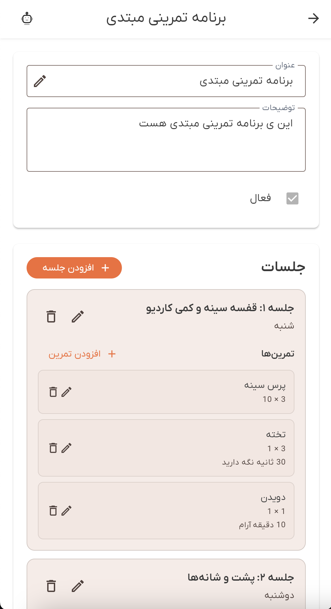

# برنامه‌های تمرینی

برنامه‌های تمرینی جایی هستن که برنامه تمرینیت رو می‌سازی. فکرشو بکن مثل نقشه تمرینیت - جلسات مرتب شده بر اساس روزهای هفته، تمرینات با ست و تکرار، همه چیز ساختار داره تا تو مسیر درست بمونی.

## چطور برم اونجا

از منوی اصلی برو بخش تمرین، بعد تب "برنامه‌های تمرینی" رو بزن. همه برنامه‌هات اونجا هستن.

## چی می‌بینی

هر برنامه عنوانش، توضیحاتش (اگه اضافه کرده باشی)، و تعداد جلساتش رو نشون میده. یه نشونگر هم داره که میگه برنامه الان فعاله یا نه. اگه هنوز برنامه‌ای نساختی، یه پیام خالی می‌بینی که بهت میگه اولین برنامه‌ت رو بساز.

برنامه زیاد داری؟ از دکمه‌های صفحه‌بندی پایین صفحه استفاده کن.

## باز کردن یه برنامه

روی هر کارت برنامه بزن تا جزئیاتش باز بشه.

بالای صفحه عنوان برنامه، توضیحات، و یه چک‌باکس برای فعال بودن برنامه رو می‌بینی. می‌خوای این برنامه رو به عنوان برنامه فعلیت علامت بزنی؟ فقط چک‌باکسش رو بزن. می‌تونی هر وقت خواستی این اطلاعات رو ویرایش کنی - آیکون مداد رو بزن، تغییراتت رو بده، و "ذخیره" رو بزن. فقط عنوان اجباریه.

پایین‌تر جلساتت هستن.

## جلسات

جلسات همون روزهای تمرینیته. هر کدوم یه عنوان داره (مثل "روز سینه" یا "روز پا")، یه روز هفته، یه توضیحات اختیاری، و لیست تمریناتش.

وقتی یه جلسه رو باز می‌کنی، همه این اطلاعات رو واضح می‌بینی. عنوان پررنگه، روز زیرش نوشته شده، اگه توضیحات داشته باشه اونم نشون داده میشه. بعدش لیست تمرینات با جزئیات ست و تکرار میاد.

هنوز جلسه نساختی؟ یه پیام دوستانه با دکمه "افزودن جلسه" می‌بینی.

### اضافه کردن جلسه

روی "افزودن جلسه" تو بخش جلسات بزن. عنوان جلسه رو بنویس (اجباریه)، یه روز از منوی کشویی انتخاب کن (شنبه تا جمعه)، و اگه خواستی توضیحات اضافه کن. "ذخیره" رو بزن و تموم.

باید جلسه رو ذخیره کنی قبل از اینکه بتونی تمرین بهش اضافه کنی.

### ویرایش و حذف

آیکون مداد روی هر جلسه رو بزن تا ویرایشش کنی. هر چی می‌خوای عوض کن و ذخیره کن. می‌خوای پاکش کنی؟ آیکون سطل زباله رو بزن و تایید کن. فقط بدون که وقتی یه جلسه رو پاک می‌کنی، همه تمریناتش هم پاک میشن و برنمی‌گردن.

## تمرینات

اینجا جای کار واقعیه. هر تمرین تو یه جلسه نشون میده کدوم تمرینه، چند ست و تکرار، و هر یادداشتی که اضافه کردی.

### اضافه کردن تمرین

تو یه جلسه ذخیره شده، روی "افزودن تمرین" بزن. یه تمرین از منوی کشویی انتخاب کن (اجباریه)، تعداد ست و تکرار رو وارد کن (هر دو باید بیشتر از صفر باشن)، و اگه خواستی توضیحات اضافه کن. یه گزینه هم هست که این تمرین رو به یه سوپرست اضافه کنی، که الان بهش می‌رسیم.

"ذخیره" رو بزن و تمرین تو جلسه‌ت ظاهر میشه.

### سوپرست‌ها

سوپرست‌ها بهت اجازه میدن تمرینات رو با هم گروه کنی - عالیه برای وقتی می‌خوای دو تا تمرین رو پشت سر هم با استراحت کم انجام بدی.

برای ساخت یه سوپرست، اول تمرین اولت رو معمولی اضافه کن. بعد تمرین دوم رو اضافه کن، و تو اون فرم، از منوی کشویی "افزودن به سوپرست" تمرین اول رو انتخاب کن. تمرین دوم بخشی از سوپرست میشه.

سوپرست‌ها با یه حاشیه و برچسب خاص نشون داده میشن. تمرین اصلی اول لیست میشه، و تمرینات فرعی تورفتگی دارن و با یه نشون "بخشی از سوپرست" علامت‌گذاری شدن. همه چیز به صورت بصری گروه‌بندی شده تا ببینی چی با چی میره.

می‌خوای سوپرست رو از هم باز کنی؟ تمرین فرعی رو ویرایش کن و روی "حذف از سوپرست" بزن تا دوباره مستقل بشه.

### ویرایش و حذف

آیکون مداد روی هر تمرین رو بزن تا ویرایشش کنی. می‌تونی خود تمرین، ست‌ها، تکرارها، توضیحات، یا حتی رابطه سوپرست رو عوض کنی. وقتی تموم شد ذخیره کن.

برای پاک کردن تمرین، آیکون سطل زباله رو بزن و تایید کن. اگه یه تمرین اصلی تو سوپرست رو پاک کنی، تمرینات فرعی می‌مونن ولی دیگه گروه‌بندی نیستن.

## هوش مصنوعی می‌تونه کمک کنه

دستیار هوش مصنوعی با برنامه‌های تمرینی خیلی خوب کار می‌کنه. وقتی داری یه برنامه رو نگاه می‌کنی بازش کن (آیکون ربات رو بزن) و ازش کمک بخواه. چیزی مثل "یه جلسه سینه و سه‌سر برای دوشنبه اضافه کن" عالی کار می‌کنه. هوش مصنوعی فیلدهای فرم رو پر می‌کنه، تو بررسی و تنظیم می‌کنی، بعد ذخیره می‌کنی. وقتی هوش مصنوعی چیزی رو آپدیت کنه یه نوتیفیکیشن آبی می‌بینی.

## وقتی مشکلی پیش میاد

برنامه‌ها لود نمیشن؟ اتصال اینترنتت رو چک کن و به پایین بکش تا رفرش بشه. اگه صفحه خطا دیدی، روی "تلاش مجدد" بزن. هنوز گیر کردی؟ یه بار لاگ‌اوت و لاگین کن.

نمی‌تونی برنامه رو ویرایش کنی؟ مطمئن شو که لاگین کردی. بعضی وقتا بستن و باز کردن اپ کمک می‌کنه.

جلسات لود نمیشن؟ اتصال اینترنتت رو چک کن که پایدار باشه و رفرش کن. پیام خطا رو بخون ببین چی میگه.

نمی‌تونی جلسه اضافه، ویرایش، یا حذف کنی؟ مطمئن شو همه فیلدهای اجباری پر شدن و به پیام‌های خطای قرمز روی فیلدها نگاه کن. یه لحظه صبر کن و دوباره امتحان کن.

تمرینات لود نمیشن؟ اتصالت رو چک کن و مطمئن شو جلسه اول ذخیره شده. اگه لازم شد رفرش کن.

نمی‌تونی تمرین اضافه کنی؟ جلسه باید ذخیره شده باشه قبل از اینکه بتونی تمرین اضافه کنی. مطمئن شو که یه تمرین از منوی کشویی انتخاب کردی و تعداد ست و تکرارت اعداد معتبری بیشتر از صفر هستن.

مشکل با سوپرست‌ها؟ مطمئن شو تمرین اصلی ذخیره شده قبل از اینکه تمرینات فرعی اضافه کنی. فقط تمرینات مستقل می‌تونن والد سوپرست باشن، و تمرینات نمی‌تونن همزمان تو چند تا سوپرست باشن. اگه چیزی درست نیست، رابطه رو پاک کن و دوباره اضافه کن.

## نکته‌ها

از عناوین جلسه واضحی استفاده کن که برات معنی داشته باشه. جلسات رو به روزهای خاص اختصاص بده و تو هفته پخششون کن. وقتی لازمه توضیحات اضافه کن - نکات فرم، یادداشت‌های شدت تمرین، هر چیزی که بهت کمک می‌کنه تو مسیر بمونی.

برای تمرینات، از تعداد ست و تکرار استفاده کن که با هدفت جور باشه. تمرینات مرتبط رو تو سوپرست‌ها سازماندهی کن برای کارایی بیشتر. انتخاب تمریناتت رو تو جلسات ثابت نگه دار تا بتونی پیشرفتت رو دنبال کنی.

فقط یه برنامه رو همزمان فعال کن. توضیحات رو مفید نگه دار. برنامه‌هات رو با تغییر هدفت آپدیت کن.

اگه کمک لازم داری، دستیار هوش مصنوعی همیشه اونجاست، یا گزینه‌های پشتیبانی رو تو تنظیمات چک کن.

