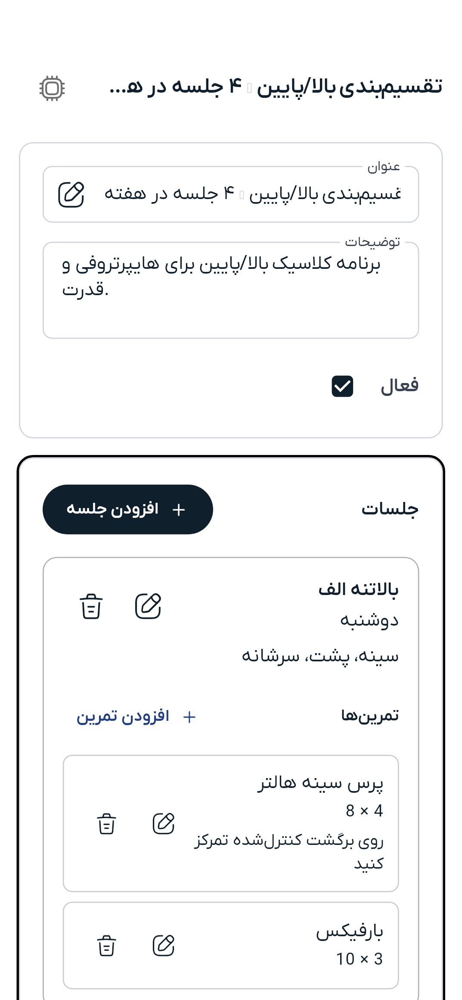

# برنامه‌های تمرینی

برنامه تمرینی از جلسات تشکیل شده — هر جلسه یک روز یا نوع تمرینه — با تمرین‌هایی که داخلشه.

---

## ساخت برنامه

۱. به **تمرین → برنامه‌های تمرینی** بروید
۲. روی **+** ضربه بزنید
۳. یک نام انتخاب کنید (مثلاً «پوش/پول/پا»، «اسپلیت ۵ روزه»)
۴. ذخیره کنید — برنامه خالی شما آماده است

---

## اضافه کردن جلسه

یک جلسه نشان‌دهنده یک روز یا نوع تمرین است (مثلاً «دوشنبه — سینه»، «بالاتنه A»).

داخل برنامه:
۱. روی **افزودن جلسه** ضربه بزنید
۲. نام جلسه را بنویسید و روز هفته را انتخاب کنید (اختیاری)
۳. ذخیره کنید

می‌توانید به تعداد مورد نیاز جلسه اضافه کنید.

---

## اضافه کردن تمرین به جلسه

داخل جلسه:
۱. روی **افزودن تمرین** ضربه بزنید
۲. تمرین را جستجو کنید یا از لیست انتخاب کنید
۳. ست‌ها را اضافه کنید — هر ست دارای **تعداد تکرار** و **وزن** هدف است
۴. ذخیره کنید

---

## سوپرست

سوپرست به شما اجازه می‌دهد دو یا چند تمرین را پشت سر هم و بدون استراحت بین آن‌ها اجرا کنید.

برای ساخت سوپرست:
۱. تمرین‌هایی که می‌خواهید گروه کنید را اضافه کنید
۲. آن‌ها را انتخاب کنید و روی **ایجاد سوپرست** ضربه بزنید
۳. به صورت مرتبط در نمای جلسه نمایش داده می‌شوند

سوپرست برای عضلات آنتاگونیست (مثل جلوبازو + پشت‌بازو) یا تمرینات سیرکویت عالی است.

---

## فعال کردن برنامه

فقط یک برنامه تمرینی می‌تواند در هر زمان فعال باشد. برنامه فعال روی داشبورد نمایش داده می‌شود و هنگام ثبت تمرین در ردیاب پیشنهاد می‌شود.

برای فعال کردن: برنامه را باز کنید و روی **تنظیم به عنوان فعال** ضربه بزنید.

---

## ویرایش یا حذف برنامه

- برای **ویرایش** جزئیات برنامه: روی آیکون مداد ضربه بزنید
- برای **حذف** برنامه: تنظیمات برنامه را باز کنید و **حذف** را بزنید
- برای **تغییر ترتیب جلسات** یا **حذف تمرین**: داخل جلسه از حالت ویرایش استفاده کنید

---

## دستیار هوش مصنوعی

روی آیکون دستیار (نماد جرقه) در هر جایی از برنامه تمرینی ضربه بزنید — از آن بخواهید تمرین پیشنهاد دهد، حرکت را توضیح دهد یا یک جلسه را بر اساس اهداف شما پر کند.

---

> **بعدی:** [برنامه غذایی بسازید](diet-plans.md) یا [تمرین‌هایتان را ردیابی کنید](tracker.md)
